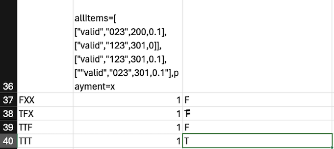

<h1>Втора лабораториска вежба по Софтверско инженерство</h1>

<h2> Горазд Филиповски 223070</h2>

<h3>Control Flow Graph</h3>

[//]: # (![CFG.png]&#40;CFG.png&#41;)

<h3>Цикломатска комплексност</h3>
(Број на ребра - број на јазли) + 2 = (31 - 23) + 2 = 10  
Број на предикатни јазли + 1 = 9 + 1 =10

<h3>Тест случаи според критериумот Every statement</h3>

[//]: # (![every-branch.png]&#40;every-branch.png&#41;)

Test Case 1:   
-allItems е null, што предизвикува RuntimeException со порака "allItems list can't be null!". Поради тоа, кодот се прекинува веднаш.   
Test Case 2:   
allItems содржи еден елемент со празно име и null баркод. Името на елементот се поставува на "unknown", и бидејќи баркодот е null, се фрла RuntimeException со порака "No barcode!".   
Test Case 3:   
allItems содржи еден елемент со невалиден баркод "12lol". Кодот го проверува секој знак од баркодот и фрла RuntimeException со порака "Invalid character in item barcode!" бидејќи баркодот содржи невалидни знаци.   
Test Case 4:   
allItems содржи два елементи: еден со баркод "023" и попуст од 0.1, и друг со баркод "123" без попуст. Вкупната цена се пресметува и споредува со payment кое е 301. Вредноста на сумата е помала или еднаква на payment, па функцијата враќа true.   
Test Case 5:   
allItems содржи два елементи: еден со баркод "023" и попуст од 0.1 и цена од 100, и друг со баркод "123" и цена од 300 без попуст. Вкупната цена се пресметува и споредува со payment кое е 301. Поради условот за намалување на 30 единици од сумата, функцијата враќа true.     

<h3>Тест случаи според критериумот Multiple Condition</h3>

[//]: # (![multiple_conditions.png]&#40;multiple_conditions.png&#41;)

-Во првата итерација (FXX), цената на првиот елемент е 200, што значи дека item.getPrice() > 300 е false (F). Останатите услови се неважни бидејќи првиот услов не е исполнет.   
-Во втората итерација (TFX), цената на вториот елемент е 301, што значи дека item.getPrice() > 300 е true (T), но попустот е 0, така што item.getDiscount() > 0 е false (F). Третиот услов е неважен.   
-Во третата итерација (TTF), цената на третиот елемент е 301, попустот е 0.1, така што и двата услови се true (TT), но баркодот не почнува со '0', така што item.getBarcode().charAt(0) == '0' е false (F).   
-Во четвртата итерација (TTT), цената на четвртиот елемент е 301, попустот е 0.1, и баркодот почнува со '0', така што сите услови се исполнети (TTT) и сумата се намалува за 30 единици.   

Со овие четири итерации, тест случајот ги поминува сите можни комбинации на условите.

<h3>Објаснување на напишаните unit tests</h3>

<h4>Метод everyBranchTest:</h4>
-Прво тестирање: Фрла RuntimeException кога allItems е null, проверува дали пораката содржи "can't be null!".   
-Второ тестирање: Тестира дали фрла RuntimeException кога barcode е null, проверува дали пораката содржи "No barcode!".   
-Трето тестирање: Тестира дали фрла RuntimeException кога barcode содржи невалидни карактери, проверува дали пораката содржи "Invalid character".   
-Четврто тестирање: Проверува дали функцијата враќа true кога вкупната сума на ставките е помала или еднаква на плаќањето.   
-Петто тестирање: Проверува дали функцијата враќа false кога вкупната сума на ставките е поголема од плаќањето.   
<h4>Метод multipleConditionsTest:</h4>
-Прво тестирање: Тестира дали функцијата враќа true кога вкупната сума на ставките (со попусти и намалувања) е помала или еднаква на плаќањето од 1000.   
-Второ тестирање: Тестира дали функцијата враќа false кога вкупната сума на ставките (со попусти и намалувања) е поголема од плаќањето од 100.   

Овие тестови обезбедуваат дека сите гранки и услови во функцијата checkCart се покриени и правилно тестирани.

